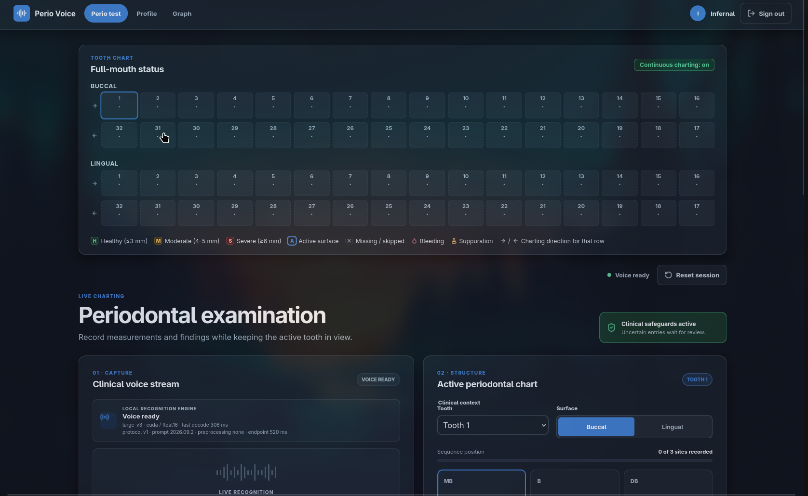
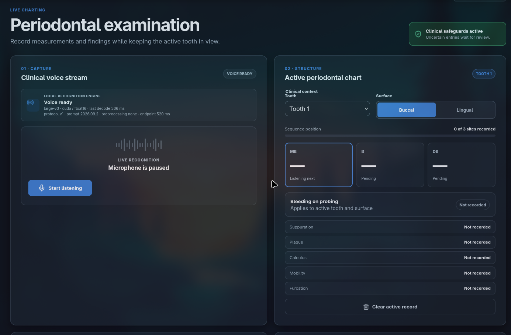
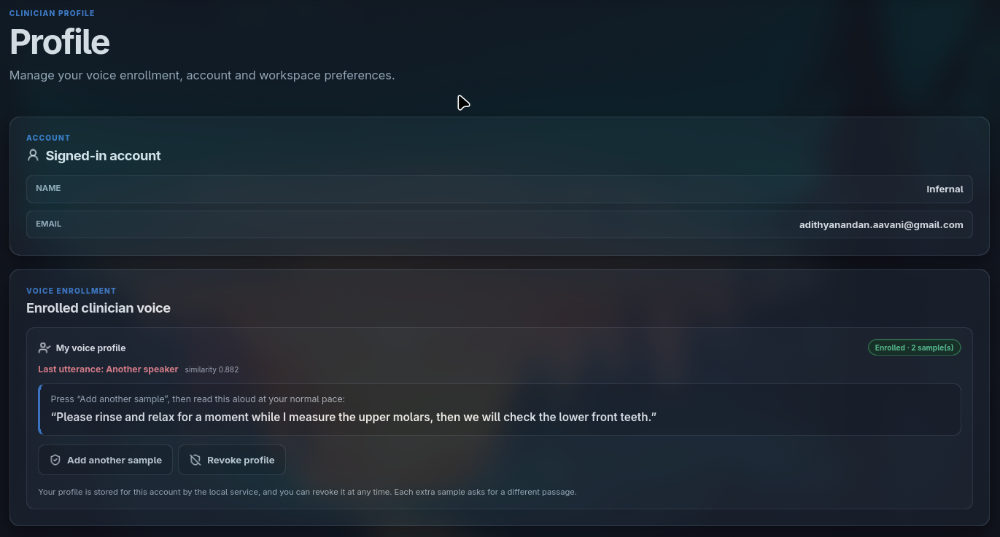
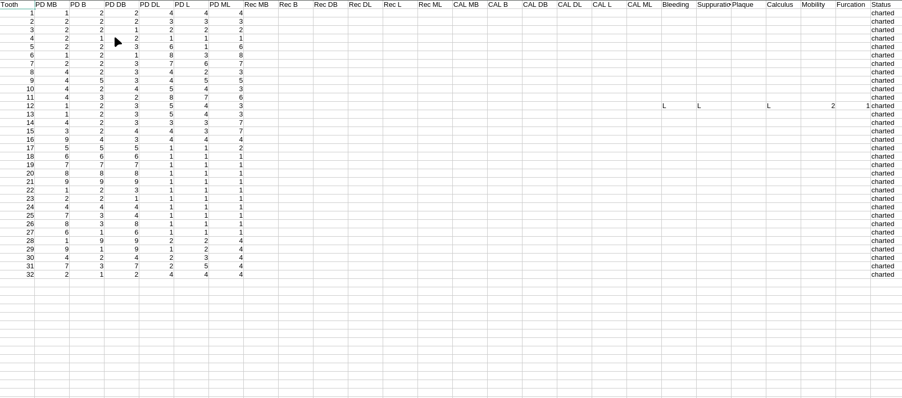

# Perio Voice

### **DSOLVE 2026** · DRISHTI · College of Engineering Trivandrum (CET)

**BUILD. SOLVE. DEMONSTRATE.**

|                   |                                                                                             |
| ----------------- | ------------------------------------------------------------------------------------------- |
| **Problem:**      | Problem 7 — Real-Time Clinical Measurement                                                 |
| **Team Name:**    | Aegis                                                                                      |
| **Team Members:** | Adithyanandan Arun · Hrishinandan Namboothiry U · Gowrinandan · Vaishnav                   |
| **Institution:**  | Amrita Vishwa Vidyapeetham                                                                  |
| **Live Demo:**    | [Watch the live demo](https://youtu.be/tBCxtAgjCFk)                                         |
| **Pitch Video:**  | [Watch the pitch video](https://www.instagram.com/reel/DdcqViShpLi/?stkn=MmJsZmxpMzMxb3h6) |

---

## Table of Contents

- [Problem Statement](#problem-statement)
- [Our Solution](#our-solution)
- [Key Features](#key-features)
- [Screenshots & Demo](#screenshots--demo)
- [Tech Stack](#tech-stack)
- [Getting Started](#getting-started)
- [Usage / Demo Script](#usage--demo-script)
- [Limitations & Future Scope](#limitations--future-scope)
- [Team](#team)
- [Submission Checklist](#submission-checklist)

---

## Problem Statement

### Problem 7: Real-Time Clinical Measurement

Develop a real-time or near-real-time voice solution that enables dental
professionals to capture and record clinical measurements with minimal delay.

The solution should process spoken measurements such as **pocket depth,
bleeding, recession, and other periodontal findings**, converting them into
structured data and reflecting them in the application almost instantly. It
should explore ways to combine speech recognition, rule-based processing, and AI
while handling corrections, repeated measurements, and natural variations in
speech.

The goal is to reduce processing latency and manual data entry, creating a
**fast, seamless, hands-free clinical documentation experience.**

### Why this matters

Periodontal charting involves many short measurements attached to exact teeth,
surfaces, and positions. A missed number can shift every following measurement;
a correctly recognized value can still be clinically wrong if it lands on the
wrong tooth. Dental professionals also speak naturally, correct themselves, talk
to patients and assistants, and work around suction, handpieces, instruments,
and other operatory noise.

The real problem is therefore not transcription alone. It is converting noisy,
fast-moving speech into the correct structured clinical event with low latency,
without allowing conversation or recognition errors to corrupt the chart.

## Our Solution

Perio Voice is a local-first voice intelligence layer for periodontal charting.
It streams browser microphone audio to a local recognizer, then sends only final
utterances through a deterministic clinical pipeline before any chart state can
change.

```text
Browser microphone
  → AudioWorklet: mono 16 kHz PCM16, 100 ms frames
  → local WebSocket /ws/asr
  → endpointing + speech-presence/noise checks
  → bounded recognition queue
  → local ASR model
  → final transcript only
  → lexicon → candidate lattice → relevance → context resolution → grammar
  → negation → correction → sequence and stale-context guards
  → immutable chart reducer + journal + audit explanation
```

The recognizer proposes what may have been said. The clinical layer decides
whether it is relevant, what it means, and where it belongs. Partial hypotheses
are feedback only and can never write to the chart. Ambiguous or invalid input
is held, ignored, or rejected rather than guessed.

The recognizer is replaceable: a usable NVIDIA GPU runs Whisper `large-v3` in
CUDA FP16; CPU deployments use the routed grammar/`tiny.en` profile. The same
ASR-independent clinical pipeline processes either output.

## Key Features

- **Real-time local capture** — browser microphone audio is streamed in small
  PCM frames over a local WebSocket connection.
- **Low-latency endpointing** — pre-roll, adaptive speech pauses, bounded
  utterances, and a serialized decode queue keep response timing predictable.
- **Noise protection** — saturated captures, non-speech audio, and prompted
  model hallucinations are filtered before text can reach the chart.
- **Enrolled voice isolation** — an enrolled-clinician voice profile helps
  distinguish authorized clinical speech from other speakers in the operatory;
  uncertain attribution is held for review rather than guessed.
- **Context-aware measurements** — phonetic alternatives such as “to / two”,
  “for / four”, and “ate / eight” are considered only when the active chart
  context permits them.
- **Atomic grouped measurements** — a sequence such as `three four five` is
  accepted as a unit, preventing one missed value from shifting later sites.
- **Corrections and repetitions** — phrases such as `four, no, five`,
  `correct that to three`, and `repeat that` replace or replay the intended
  event instead of creating duplicate chart values.
- **Clinical findings and polarity** — bleeding, suppuration, plaque, calculus,
  recession, mobility, furcation, and negated findings are converted into typed
  chart events.
- **Anatomical workflow tracking** — tooth, surface, station position, skip,
  back, resume, and stale-result protection are explicit.
- **Fail-closed auditability** — every accepted, ignored, held, rejected, or
  stale result carries a stage trace and journal entry.
- **Offline-safe fallback** — the deterministic simulator remains available when
  the recognition service or microphone is unavailable.

## Screenshots & Demo

The live interface includes authentication, model readiness, microphone capture,
the periodontal tooth chart, workflow controls, confirmations, history, and
latency/recognition metrics. The current build is shown below.

| View | Screenshot |
| ---- | ---------- |
| Full-mouth tooth chart and continuous charting |  |
| Live voice capture and active periodontal chart |  |
| Enrolled clinician voice profile |  |
| Structured periodontal export |  |

| Resource | Description |
| -------- | ----------- |
| [Pitch video](https://www.instagram.com/reel/DdcqViShpLi/?stkn=MmJsZmxpMzMxb3h6) | Team Aegis product pitch |
| [Source repository](https://github.com/AdithyanandanArun/perio-voice) | Team Aegis source code |
| [Architecture](./ARCHITECTURE.md) | Runtime topology, pipeline boundaries, safety, and deployment profiles |
| [Evaluation](./EVALUATION.md) | Accuracy, latency, noise, and fixture methodology |

## Tech Stack

| Layer | Technology | Why we chose it |
| ----- | ---------- | --------------- |
| Frontend | React 18, TypeScript, Vite | Fast browser UI, typed clinical state, and responsive live chart updates |
| Audio capture | Browser `AudioWorklet`, WebSocket, PCM16 | Low-overhead streaming with explicit audio framing and no browser-vendor ASR dependency |
| Backend | Python 3.12, FastAPI, Uvicorn | Async WebSocket sessions, model lifecycle, endpointing, and bounded queues |
| Recognition | Faster-Whisper `large-v3` CUDA FP16; CPU grammar/`tiny.en` fallback | Strong local replay accuracy while keeping the recognizer replaceable |
| Clinical NLP | TypeScript lexicon, candidate lattice, relevance, context resolver, typed grammar | Explainable and testable clinical decisions instead of unconstrained generation |
| State and audit | Immutable session reducer, append-only journal, local SQLite account/profile data | Atomic chart updates, undo/redo, stale protection, and traceable decisions |
| Development fixtures | Pinned Piper TTS replay through laptop speakers and microphone | Exercises the real browser/audio path without presenting synthetic speech as human evidence |
| Deployment | Local workstation; optional NVIDIA GPU | Captured audio remains on the local machine in the prototype |

## Getting Started

### Prerequisites

- Node.js 20.19+ (or 22.12+)
- npm
- `uv` for the pinned Python 3.12 environment
- A modern browser with microphone, AudioWorklet, and WebSocket support
- NVIDIA GPU with CUDA libraries for the recommended `large-v3` profile; CPU
  fallback is supported

### Installation

```bash
git clone https://github.com/AdithyanandanArun/perio-voice.git
cd DSOLVE
npm install
npm run setup
npm run dev
```

Open `http://127.0.0.1:5173`, create a local account, wait for **Voice model
ready**, allow microphone access, and select **Start listening**.

The first GPU start downloads the local `large-v3` artifact and loads it into
approximately 3.9 GB of VRAM. Later starts reuse the local model. Without a
usable NVIDIA GPU, the service selects its CPU profile.

### Environment variables

All recognition settings are optional and are defined in `server/config.py`.

| Variable | Purpose | Example |
| -------- | ------- | ------- |
| `ASR_DEVICE` | Select `auto`, `cuda`, or `cpu` | `auto` |
| `ASR_MODEL` | Override the recognition model | `large-v3` |
| `ASR_ENGINE` | Select the recognition engine | `whisper` |
| `ASR_MODEL_DIR` | Local model artifact directory | `models` |
| `ASR_ALLOWED_ORIGINS` | Trusted browser origins | `http://127.0.0.1:5173` |
| `API_KEY` | Optional key for an external integration, when enabled | `your-api-key` |
| `PERIO_FIXTURE_CAPTURE` | Enable development-only fixture capture | `1` |

Never commit credentials, patient data, model secrets, or private recordings.

## Usage / Demo Script

This is a three-to-five-minute demonstration runbook.

1. **Boot and readiness** — start the app, sign in, and show that the local
   model reports its device and readiness state.
2. **Grouped measurements** — start listening and say `three four five`.
   Demonstrate that the values appear in the correct periodontal sites.
3. **Natural correction** — say `four, no, five` or `correct that to three` and
   show replacement rather than duplication.
4. **Contextual speech** — demonstrate a phrase such as `to for ate` while
   probing depths are expected; explain that the same sounds are not globally
   converted into numbers.
5. **Clinical findings and negation** — demonstrate `bleeding`, `no bleeding`,
   or `no bleeding or suppuration`.
6. **Safety behavior** — say conversational or assistant-directed text and show
   that it does not silently change the chart; ambiguous input appears as a
   confirmation or held event.
7. **Workflow** — show tooth/surface navigation, skip/resume, history, and the
   audit explanation.
8. **Close** — explain that only final, validated events cross the chart boundary
   and that the system is a prototype awaiting human clinical validation.

## Limitations & Future Scope

### Known limitations

- The replay corpus uses a pinned synthetic Piper voice; it is not a measure of
  clinician accuracy across accents, rooms, or microphones.
- Long-form continuous-speech duplication has architectural mitigations but does
  not yet have a dedicated human stress test.
- A GPU A/B study of Whisper previous-text conditioning remains open.
- Classical short-utterance speaker attribution is not reliable enough to be the
  primary safety boundary and is disabled by default.
- Overlapping speakers are not solved.
- The prototype has one model worker per process rather than a multi-operatory
  worker pool.
- There is no production EHR integration, regulated audit retention, signed model
  registry, or compliance certification.
- Cloud-ASR exploration is paused; local and cloud paths have not been shown
  equivalent.

### Future scope

- Collect a consented, stratified clinician dental-speech corpus.
- Run long-form, overlap, accent, and previous-text-conditioning evaluations.
- Add a trained speaker-embedding model behind the existing attribution API.
- Add admission control and model-worker pools for multiple operatories.
- Pre-provision signed model artifacts and add rollback/version policy.
- Add production EHR integration, encrypted persistence, role-based access,
  retention controls, and regulated clinical review.

## Team

| Name | Role(s) | GitHub | Email |
| ---- | ------- | ------ | ----- |
| Adithyanandan Arun | Lead Developer | [@AdithyanandanArun](https://github.com/AdithyanandanArun) | [adithyanandan.aavani@gmail.com](mailto:adithyanandan.aavani@gmail.com) |
| Hrishinandan Namboothiry U | Team Lead | [@Hri5hi](https://github.com/Hri5hi) | [hrishinandan3@gmail.com](mailto:hrishinandan3@gmail.com) |
| Gowrinandan | Junior Developer | [@Bloodhound-23](https://github.com/Bloodhound-23) | [itsmegowri73@gmail.com](mailto:itsmegowri73@gmail.com) |
| Vaishnav | Junior Developer | [@vaishnavdr](https://github.com/vaishnavdr) | [vaishnavdrofficial@gmail.com](mailto:vaishnavdrofficial@gmail.com) |

## Submission Checklist

- [x] Problem 7 and the official problem statement are documented
- [x] Team name and member names are included
- [x] Pitch video link is included
- [x] Quick-start commands are documented
- [x] Institution is confirmed
- [x] Live demo URL is added
- [x] Team roles and contact details are added
- [x] Screenshots are added
- [x] Fresh-clone installation is verified
- [x] Secrets and private recordings are excluded from the repository

---

**Project references:** [full problem context](./Full_Problem_Statement.md) ·
[architecture](./ARCHITECTURE.md) · [evaluation](./EVALUATION.md)
